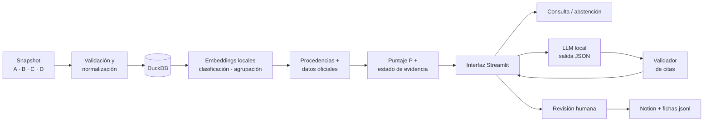

# 🏗️ Diseño de solución

## Arquitectura

**Principio:** la IA se usa donde aporta comprensión del lenguaje (agrupar, clasificar, buscar, redactar). Todo lo que debe ser 100% confiable y reproducible (validar, puntuar, verificar citas) es código determinista.

## Stack

| Capa | Herramienta | Motivo |
|---|---|---|
| Lenguaje | Python 3.11 | Ecosistema de datos y NLP |
| Dependencias | Poetry (`pyproject.toml` + `poetry.lock`) | Versiones fijadas y reproducibles (D-40) |
| Datos | pandas + pandera | Validación con acumulación de errores |
| Almacenamiento | DuckDB | Un archivo, sin servidor, offline |
| Embeddings | sentence-transformers con `multilingual-e5-small` (D-20, propuesta) | Offline, gratis, reproducible |
| Agrupación | scikit-learn (clustering aglomerativo con umbral) | Explicable, sin fijar número de grupos |
| LLM | Ollama local; DeepSeek si se cumple el criterio de D-02 | Offline por diseño |
| Salidas | pydantic | Formato JSON obligatorio y modelo `Ficha` |
| Plantillas | Jinja2 | Exportación de fichas a Markdown para Notion (D-39) |
| Interfaz | Streamlit | Rápido de construir (D-07, propuesta) |
| Pruebas | pytest | T01–T10 automatizadas |

## Flujo

| # | Paso | Tipo | Pruebas |
|---|---|---|---|
| 0 | Configuración versionada (YAML) | Código | — |
| 1 | Cargar y validar; reporte de calidad | Código | T01 |
| 2 | Normalizar (UTC, URL, nulos) y almacenar | Código | T03 |
| 2b | Limpiar titulares y marcar ruido (marcar, no borrar) | Código + IA | X01 |
| 3 | Embeddings | IA | — |
| 4 | Clasificar en 6 temas (vs. baseline de palabras clave) | IA | — |
| 5 | Agrupar por evento con ventana de tiempo | IA | T02 |
| 6 | Contar procedencias independientes | Código | CU-03 |
| 7 | Contextualizar: Banco Mundial por subtema + sismos USGS | Código | T04 |
| 8 | Priorizar (P) | Código | T08 |
| 9 | Estado de evidencia, vacíos, contradicciones | Código + IA | T03, T05 |
| 10 | Consulta en español con abstención previa al LLM | IA + código | T06 |
| 11 | Generación en dos pasos: afirmaciones validadas → una llamada por sección | IA | T07, T09 |
| 12 | Validador de citas | Código | T09 |
| 13 | Caché | Código | T10 |
| 14 | Interfaz (6 pantallas) | — | — |
| 15 | Revisión humana y Notion | Humano | — |
| 16 | Evaluación (pytest + benchmark) | Código | Todas |

## Modelo de datos

### Tablas (DuckDB · `data/senales.duckdb`)

| Tabla | Una fila por | Campos principales | Se relaciona con |
|---|---|---|---|
| `noticias` | Titular | id_noticia (`NOT-`), titulo_original, titulo_limpio, url, medio, dominio, pais_medio, idioma, fecha_publicacion, fecha_deteccion, origen, agencia, tipo_firma, tema, subtema, tema_secundario, similitudes, es_ruido, motivo_ruido, id_grupo | `grupos` |
| `indicadores` | País × indicador × año (1.350) | id (`IND-`), pais_iso3, indicador_id, anio, valor (nullable), unidad, fuente_url, licencia | `vinculos` |
| `sismos` | Evento USGS | id (`SIS-`), magnitude, time, place, depth, status, url | `vinculos` |
| `grupos` | Evento agrupado | id_grupo (`GRP-`), tema, subtema, titular_central, n_titulares, n_medios, n_procedencias, R, I, U, N, E, P, rango, version_reglas, estado_evidencia, accion | `noticias`, `vinculos`, `casos` |
| `vinculos` | Relación grupo ↔ evidencia oficial | id_grupo, id_evidencia, tipo (directa · indirecta · evento), regla, limitacion, motivo_sin_vinculo, rechazado | `grupos`, `indicadores`, `sismos` |
| `vacios` | Vacío de un grupo | id_grupo, tipo_vacio, verificacion_sugerida, fuente_sugerida, orden | `grupos` |
| `casos` | Grupo abierto para revisión | id_caso (`CASO-`), id_grupo, modalidad, caso_de_uso | `grupos`, `borradores`, `revisiones` |
| `borradores` | Versión de un borrador | id_caso, version, tipo_paquete, secciones (JSON), afirmaciones (JSON), alcance_texto, origen (LLM · persona) | `casos` |
| `revisiones` | Acción de revisión (solo agregar) | id_caso, version, accion, estado_anterior, estado_nuevo, revisor, rol, fecha_utc, comentario, motivo, diferencias | `casos` |
| `rechazos` | Afirmación rechazada por el validador | id_caso, version, regla, texto, modelo | `borradores` |

### Identificadores estables (D-63)
| Prefijo | Cómo se forma |
|---|---|
| `NOT-` | SHA-1 de la URL canónica (10 caracteres) |
| `IND-` | país-indicador-año |
| `SIS-` | id de USGS |
| `SBP-` | serie-período |
| `GRP-` | hash de los `NOT-` del grupo, ordenados |
| `CASO-` | correlativo, persistente desde que se abre |
| `SYN-` | datos sintéticos |

El mismo dato produce siempre el mismo ID. El campo `tema` de `noticias.csv` es el **tema de origen**; el del clasificador es `tema_clasificado` (D-62).

### Archivos del contrato
`noticias.csv`, `fuentes.json`, `indicadores.csv`, `eventos.geojson`, `fichas.jsonl`, `manifest.json`, `benchmark.jsonl` y diccionario de datos, en `raw/` y `processed/`.

Una cita válida es siempre **ID + campo** (ej. `IND-PAN-FP.CPI.TOTL.ZG-2023 · valor`). Una URL sin relación con la afirmación no es cita.

## Versiones

Todo resultado se produce con una combinación de versiones; la ficha y `fichas.jsonl` guardan cuáles se usaron.

| Componente | Versión actual | Dónde se registra |
|---|---|---|
| Snapshot de datos | _por definir_ (manifest) | `data/manifest.json` · Catálogo de datos |
| Reglas de puntaje | **v1.3** | `config/reglas_v1.3.yaml` · D-06, D-15, D-35, D-56 |
| Guía de temas | v1 | `docs/guia_temas.md` · D-30 |
| Prompts | v0.1 | Base *Prompts* |
| Modelo de embeddings | _por confirmar_ (propuesta: multilingual-e5-small) | `config/` · D-20 |
| Modelo LLM | _por definir en E0-07_ (tag de Ollama) | `docs/eleccion_modelo.md` · D-02 |
| Definición de salidas | v1 | `docs/salidas.md` · D-53 |
| Código | _commit o tag de entrega_ | Repositorio GitHub |
| Semillas aleatorias | Fijas en `config/` | Registro de parámetros · D-65 |

**Reproducibilidad (D-65):** `scripts.reproducir --verificar` reconstruye todo desde `raw/` y compara los SHA-256 de las salidas deterministas con el manifest (prueba X06).

## Cumplimiento de la sección 8

| Requisito | Cómo se cumple |
|---|---|
| Arquitectura: fuentes → validación → almacenamiento → búsqueda y agrupación → priorización → generación → interfaz → revisión → Notion | Diagrama de arriba; una etapa por spec (E0-04 a E1-16); carga por lote; sin internet en el pitch |
| Al menos una capacidad de ML/NLP | Clasificación semántica, agrupación por similitud y recuperación semántica con embeddings |
| LLM sobre evidencia recuperada, instrucciones separadas, salida con citas y vacíos | Ficha como única entrada; evidencia en `<evidencia>`; JSON con afirmaciones, citas y vacíos |
| Baseline y cuándo la IA no ayuda | Un baseline por tarea y análisis de errores (D-66, subpágina *Modelos y costos*) |
| Modelo, versión, prompts, parámetros, costo, limitaciones | *Modelos y costos* + base *Prompts* (D-67) |
| Control humano con 5 estados | Etapa 7 (D-46) |
| Anti-alucinación (hechos, declaraciones, entrevistados, cifras, causalidades, fuentes) y abstención | Validador: citas, tipos (D-41), entrevistas (D-53), cifras, **causalidad (D-68)**, lectura simulada (D-51); abstención previa al LLM |
| Anti-inyección | Separación de instrucciones, T07, marca de fuente sospechosa (D-69) |
| Privacidad y reputación | Sin autores (D-32), sin perfiles por persona, **acusaciones solo atribuidas (D-68)** |
| Derechos y acceso | Solo metadatos; condiciones en el Catálogo; Notion solo con equipo y jurado |
| Credenciales, dependencias y costos | `.env`, redacción en logs (D-69), Poetry con lockfile, tope de costo (D-67) |
| Una alerta es una invitación a investigar | Tono, volumen y repetición fuera del puntaje; tabla de acciones sin "publicar" ni alertas definitivas |

## Vínculos con evidencia oficial (etapa 3)

| Tema · subtema | Evidencia oficial | Relación |
|---|---|---|
| Economía · crecimiento | PIB (`NY.GDP.MKTP.KD.ZG`) | Directa |
| Economía · inflación y precios | Inflación (`FP.CPI.TOTL.ZG`) | Directa |
| Economía · empleo | Desempleo (`SL.UEM.TOTL.ZS`) | Directa |
| Economía · comercio exterior | Exportaciones/PIB (`NE.EXP.GNFS.ZS`) | Directa |
| Logística/Canal · cualquiera | Exportaciones/PIB | Indirecta (no mide tránsitos ni carga) |
| Servicios públicos · telecom e internet | Uso de internet (`IT.NET.USER.ZS`) | Directa |
| Eventos naturales · sismos | USGS | Evento |
| Resto de subtemas | — | Sin dato (`tema_sin_indicador`) |

Formato obligatorio de cada dato: país · indicador · año · valor y unidad · ID · comparables del mismo año · tendencia de 5 años · nota de limitación.
Motivos sin vínculo: `tema_sin_indicador` · `sin_dato_en_periodo` · `sin_evento_coincidente` · `fuera_de_cobertura` · `candidatos_ambiguos`.

## Reglas de puntaje · v1.3 (D-35, D-56)

**P = 30R + 25I + 20U + 15N + 10E** · bajo [0, 40), medio [40, 70), alto [70, 100] · desempate: mayor U, luego menor ID.
Las similitudes se convierten a **percentil dentro del snapshot** antes de usarse.

| Comp. | Cálculo |
|---|---|
| R | 0.5 × foco (1 si Panamá es el sujeto principal; 0.5 si es noticia de otro país que afecta a Panamá) + 0.5 × percentil de la similitud temática |
| I | 0.5 × alcance del subtema (tabla documentada en YAML) + 0.5 × alcance geográfico (nacional 1 · provincial 0.6 · local 0.3 · desconocido 0.5) |
| U | 1 si la publicación más reciente del grupo tiene <24 h respecto al corte; baja lineal a 0 a los 7 días. Sin fecha de publicación: se usa la detección y se agrega un vacío |
| N | 1 − percentil de la similitud máxima con grupos anteriores (ordenados por fecha de publicación) |
| E | 0.5 × min(procedencias independientes / 3, 1) + 0.3 × (hay dato o evento oficial) + 0.2 × (proporción de titulares con medio y fecha de publicación conocidos) |

En banca, el alcance se mide por sector en lugar de subtema.
Prohibido usar tono, cantidad de titulares o palabras alarmistas en cualquier componente.

## Acción recomendada (rango × estado de evidencia)

| | Suficiente | Parcial | Insuficiente |
|---|---|---|---|
| **Alto** | Producir borrador | Completar evidencia y producir | Investigar ya |
| **Medio** | Borrador opcional | Vigilar | Vigilar |
| **Bajo** | Archivar como contexto | Archivar | Archivar |

Ninguna celda habilita publicar.

**Cómo se mide el puntaje:** reproducibilidad (test) · recálculo en Notion · test por componente · estabilidad (X02) · distribución de cada componente e independencia del estado (X04) · Precision@5 frente al editor y frente al baseline *ranking por fecha* (X05).

**E vs. estado de evidencia:** E mide cuánta evidencia hay (10 de 100); el estado mide si alcanza para trabajar e incluye contradicciones y cifras sin respaldo. Se calculan con reglas distintas y se muestran por separado.

## Ficha de evidencia (etapa 5 · común a ambas modalidades)

Se arma sin LLM con `src/ficha.py` (D-36). La misma función alimenta la app, la exportación a Notion y `fichas.jsonl`.

| Parte | Contenido |
|---|---|
| Qué se reporta | Titular más central (preferencia: español y medio panameño) · cobertura (titulares, medios, fechas) · leyenda de titular/metadatos · ambas versiones si hay contradicción |
| Quién lo reporta | Medio, país del medio, agencia y tipo de firma, fecha y enlace por titular · procedencias independientes estimadas y su explicación · ¿el medio de referencia ya lo cubrió? |
| Qué está respaldado | Conteos de reportes, datos y eventos oficiales (hecho, con cita y limitación) · lo que dicen los titulares (declaración atribuida) |
| Qué falta comprobar | Vacíos por reglas con verificación sugerida (top 3 arriba) · fuentes sugeridas por subtema, como sugerencia (D-37) |
| Acción recomendada | Tabla 3×3 de la modalidad, con motivo y siguientes pasos |

**Lo que cambia por modalidad (D-38), solo por YAML:**

| | Editorial | Banca |
|---|---|---|
| Medio de referencia | TVN | — |
| Fuentes sugeridas extra | — | SBP, MEF, INEC |
| Acciones (alto / suficiente → insuficiente) | Producir borrador · Completar evidencia y producir · Investigar ya | Incluir en el boletín como observación · Incluir como señal a confirmar · Seguimiento prioritario |
| Acciones (medio) | Borrador opcional · Vigilar · Vigilar | Incluir como contexto · Seguimiento · Seguimiento |
| Acciones (bajo) | Archivar | Archivar |

Ninguna acción habilita publicar ni emitir una alerta definitiva.

## Borrador (etapa 6)

**Entrada única:** la ficha. **Paso 1:** afirmaciones citadas y validadas. **Paso 2:** redacción solo con afirmaciones aprobadas.

| Tipo | Qué es | Regla |
|---|---|---|
| Hecho | Dato oficial o conteo de reportes | Cita `IND-` / `SIS-` / `SBP-` o lista de `NOT-` |
| Declaración | Lo que reporta un medio | Cita `NOT-` y atribución en el texto |
| Inferencia | Conclusión de otras afirmaciones | Cita sus afirmaciones base; sin cifras, fechas ni nombres nuevos |
| Hipótesis | Posibilidad a investigar | Redacción condicional; sin datos nuevos |

En banca se muestran como *observación* (hecho, declaración) e *hipótesis de impacto* (inferencia, hipótesis).

| Acción de la ficha | Qué se genera (D-42) |
|---|---|
| Producir borrador | Paquete completo |
| Completar evidencia y producir | Paquete completo con vacíos arriba |
| Investigar ya · Vigilar | Paquete de investigación (sin guion ni copy) |
| Archivar | Nada |

Fuentes y verificaciones se copian de la ficha (D-43). Generación: 1 llamada de afirmaciones + 4 de redacción, bajo demanda (D-44). Comillas literales, fechas verificadas y traducciones marcadas (D-45).

## Revisión humana (etapa 7)

| Acción | Estado resultante |
|---|---|
| Abrir | En revisión |
| Aceptar | Aprobado como borrador |
| Corregir | Nueva versión, sigue en revisión (revalidada, D-48) |
| Pedir evidencia | Requiere evidencia |
| Descartar (motivo obligatorio) | Descartado |
| Reabrir (con motivo) | En revisión |

Registro de solo agregar en la tabla `revisiones` (D-47). Revisor elegido de una lista, sin login (D-49). Exportación manual a Notion con ID `CASO-` estable, versión, historial y leyenda (D-50).

## Restricción común (D-51)

Toda salida declara **"basado únicamente en titular/metadatos"** (o la variante con descripción del RSS). Nunca se simula la lectura del artículo completo; las frases que lo sugieren están prohibidas en el validador.

## Estado de evidencia (independiente de P)

| Estado | Regla |
|---|---|
| Insuficiente | 1 procedencia independiente y sin dato oficial vinculado |
| Parcial | 2 o más procedencias, o 1 procedencia + dato oficial |
| Suficiente para el borrador | 2 o más procedencias, sin contradicción abierta y, si hay cifras, con dato oficial |

## Modalidades

| Pieza | Editorial | Banca |
|---|---|---|
| Salida | Brief ≤250, título, enfoque, 3 preguntas, verificaciones, guion 45–60 s, copy ≤80, titulares propuestos, resumen web | Boletín ≤250: sectores, horizonte, evidencia, 3 preguntas |
| Etiquetas | Hecho / declaración / inferencia / hipótesis | Observación / hipótesis de impacto |
| Reglas extra | No inventar entrevistas, citas ni imágenes | Sin compra/venta, pérdidas, impagos, cartera ni scores |

Mapeo tema → sector (propuesta D-11): economía → economía; logística/Canal → logística; turismo → turismo; regulación → regulación; servicios públicos y eventos naturales → continuidad operativa.

## Reglas del validador

- Un titular es **declaración**; `hecho` solo con datos oficiales o conteos de reportes (D-18).
- Números normalizados antes de comparar.
- Guion dentro del rango de palabras; solo marcadores `[VISUAL: a definir por producción]` (D-25).
- Copy sin palabras sensacionalistas de la lista del YAML.
- Cada oración de una sección referencia una afirmación validada (D-22).

- Toda afirmación factual cita un ID existente y un campo existente.
- Las cifras del texto coinciden con el valor citado.
- Una cita `IND-` exige el año en el texto y prohíbe "actual", "hoy" o "actualmente".
- Límites de palabras por formato.
- Leyenda "basado únicamente en titular/metadatos" cuando aplique.
- Reglas extra de banca.

## Límites del sistema

- Solo titulares y metadatos: no hay lectura de artículos completos.
- Las procedencias independientes son una **estimación**.
- Los datos del Banco Mundial son anuales y llegan como máximo a 2024.
- Los sismos de USGS cubren 2024 y una caja regional que no equivale a Panamá.
- El sistema no confirma ni desmiente noticias.
- El filtro de ruido puede equivocarse; los registros marcados se conservan y se pueden revisar.
- Cada dato oficial se muestra con su nota de limitación (anual, último año disponible, posible revisión).
